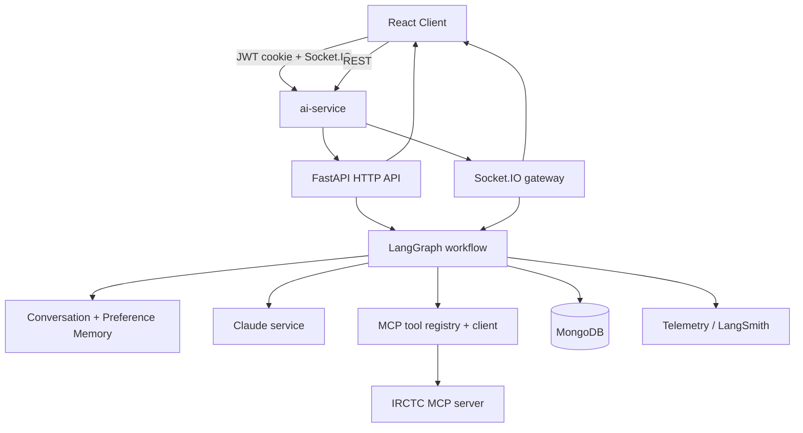
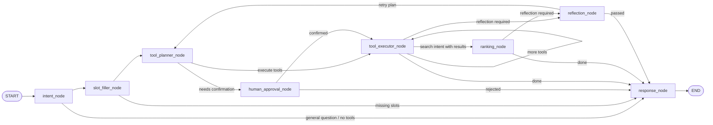

# AI Service

FastAPI-based orchestration layer for the IRCTC assistant. This service owns the AI runtime, tool planning, LangGraph execution, conversation persistence, Socket.IO streaming, and the bridge to the MCP tool server.

## What This Service Does

The ai-service is the central brain of the stack. It receives chat requests from the client, classifies the user intent, fills missing travel slots, plans MCP tool calls with Claude, executes those tools, ranks search results, optionally requests human approval for destructive actions, and streams the final response back to the UI.

It is intentionally split into small layers:

- HTTP API for request/response and conversation history
- Socket.IO for streaming chat, tool progress, and interrupt/resume flows
- LangGraph for deterministic orchestration and state management
- MCP client/registry for dynamic IRCTC tool discovery and execution
- Memory and conversation services for long-lived context, preferences, and summaries
- Claude service for intent classification, planning, reflection, and final response generation

## System Design



The system is designed so that Claude decides intent, plans steps, and reviews output, while Python owns the deterministic parts: slot validation, tool execution, ranking, retries, confirmations, and persistence.

## LangGraph Flow

The graph is built in [app/graph/builder.py](app/graph/builder.py) and routes through a compact set of nodes.



### Node responsibilities

- `intent_node`: classifies the user request, extracts travel entities, merges user preferences, and resets per-turn working state.
- `slot_filler_node`: checks whether the primary intent has all required inputs and prepares one clarification question when needed.
- `tool_planner_node`: asks Claude to produce an ordered tool plan from the live MCP registry and current travel context.
- `human_approval_node`: interrupts the graph for destructive actions such as booking, cancellation, boarding-point changes, or reminder deletion.
- `tool_executor_node`: executes one tool or a parallel group of tools through the MCP registry, applies results back into graph state, and handles retries.
- `ranking_node`: performs deterministic train ranking in Python, not in Claude.
- `reflection_node`: asks Claude to quality-check the tool output and either pass the response or trigger a single replanning retry.
- `response_node`: renders the final assistant reply with Claude using the current conversation and tool context.

## Request Lifecycle

### HTTP chat path

1. Client sends `POST /api/v1/chat` or `POST /api/v1/chat/stream`.
2. The request is validated by FastAPI schemas.
3. `ChatService` handles plain Claude chat without graph execution.
4. Streaming responses are emitted as SSE frames for `/chat/stream`.

### Agent path

1. Client sends `POST /api/v1/agent` or a Socket.IO `query:send` event.
2. The service opens or resumes the conversation and loads preference memory.
3. LangGraph classifies the intent and decides whether slots, tools, approval, or reflection are needed.
4. MCP tools are discovered dynamically from the MCP server and executed by the registry.
5. Results are saved to MongoDB and summarized periodically.
6. Final output is returned as JSON over HTTP or streamed as chunks over Socket.IO.

## API Surface

All REST endpoints are mounted under `/api/v1`.

### Health

- `GET /api/v1/health` returns service status and environment.

### Chat

- `POST /api/v1/chat` returns a non-streaming Claude response.
- `POST /api/v1/chat/stream` streams Claude output as SSE.
- `POST /api/v1/agent` runs the full LangGraph agent and returns the final agent state summary.

### Conversations

- `GET /api/v1/conversations/{conversation_id}/messages` returns message history.
- `GET /api/v1/conversations/{conversation_id}/context` returns summary plus recent messages for resume flows.
- `GET /api/v1/conversations/user/{user_email}` returns recent conversations for a user.
- `POST /api/v1/conversations/{conversation_id}/summarize` manually triggers a rolling summary.

### WebSocket

The app includes a lightweight FastAPI WebSocket endpoint at `/ws`, but the production realtime channel is Socket.IO mounted by [app/main.py](app/main.py) and handled in [app/websocket/manager.py](app/websocket/manager.py).

## Socket.IO Events

Client to server:

- `query:send`
- `resume`

Server to client:

- `query:ack`
- `agent:typing`
- `tool:start`
- `tool:done`
- `tool:failed`
- `message:chunk`
- `message:complete`
- `message:error`
- `agent:interrupt`

The streaming flow is:

```text
client -> query:send
server -> query:ack
server -> agent:typing true
server -> tool:start / tool:done / tool:failed
server -> message:chunk
server -> message:complete
server -> agent:typing false
```

When a destructive action needs confirmation, the graph pauses and emits `agent:interrupt`. The client responds with `resume` and the graph continues from the saved checkpoint.

## Project Layout

```text
app/
	api/          HTTP routers for chat, conversations, health, and websocket helpers
	auth/         JWT parsing and authorization helpers
	config/       Settings and constants loaded from environment variables
	core/         Lifespan hooks, exception handlers, and shared runtime setup
	db/           MongoDB models and repositories
	graph/        LangGraph state, routing, tool preconditions, and nodes
	llm/          Claude client, structured output, prompts, and streaming helpers
	mcp/          MCP discovery, registry, session, transport, and normalization
	memory/       Conversation memory, preference memory, checkpoints, and context builders
	schemas/      Request and response schemas for chat, health, and errors
	services/     Domain services such as chat and conversation management
	telemetry/    Logging, tracing, and metrics hooks
	websocket/    Socket.IO server, events, and session management
```

## Data And State

### Graph state

The LangGraph state holds the working travel context, tool plan, results, history, and execution metadata. The graph uses it to keep the orchestration deterministic across tool retries, human approval, and resume events.

Typical state fields include:

- `messages`
- `intent`
- `user_goal`
- `travel`
- `tool_plan`
- `tool_plan_args`
- `tool_history`
- `search_results`
- `ranked_results`
- `reflection_feedback`
- `confirmation_required`
- `confirmed`
- `execution_metrics`

### Conversation memory

[app/services/conversation_manager.py](app/services/conversation_manager.py) owns the conversation lifecycle:

- `open()` loads or creates a conversation and hydrates preference memory.
- `build_context()` returns rolling summary plus recent messages for resume.
- `save_turn()` persists user and assistant messages plus execution logs.
- `summarize()` refreshes the rolling summary periodically.
- `close()` flushes in-memory preference state back to MongoDB.

### Preference memory

The intent node merges saved user preferences into the current travel context before planning. This keeps recurring defaults such as travel class or quota available across turns.

## MCP And Tooling

The MCP layer is fully dynamic:

- Tools are discovered from the MCP server at startup.
- Schemas are exposed to Claude in Anthropic tool format.
- Tool execution goes through `MCPToolRegistry`, which normalizes responses and rejects unknown tool names.
- `tool_executor_node` applies tool results back into graph state and stores generic results for the final response prompt.

The planner explicitly prefers these deterministic tool chains:

- Booking: `search_trains` -> `check_availability` -> `get_fare` -> `book_ticket`
- Live status: `search_train_by_number` -> `get_live_status`
- Station lookup: `find_station_code`

## Ranking Logic

Search results are ranked in [app/graph/nodes/ranking_node.py](app/graph/nodes/ranking_node.py) with pure Python rules:

- cheapest: fare ascending
- fastest: duration ascending
- best availability: seats descending, then fare ascending

This keeps ordering deterministic and avoids letting the model perform a task that is better handled by code.

## Configuration

Settings are read from environment variables in [app/config/settings.py](app/config/settings.py).

Required:

- `ANTHROPIC_API_KEY`

Common optional values:

- `APP_NAME`
- `APP_ENV`
- `DEBUG`
- `ANTHROPIC_DEFAULT_MODEL`
- `LOG_LEVEL`
- `LANGSMITH_TRACING`
- `LANGSMITH_ENDPOINT`
- `LANGSMITH_API_KEY`
- `LANGSMITH_PROJECT`
- `MCP_SERVER_URL`
- `MCP_SERVER_TIMEOUT`
- `MONGO_URL`
- `MONGO_DB`

## Run Locally

```bash
uvicorn app.main:app --reload
```

With Docker:

```bash
docker compose up --build
```

The service starts the FastAPI app, mounts the Socket.IO server, and enables hot reload when `DEBUG=true`.

## Development Notes

- `app/main.py` is the ASGI entrypoint. It configures logging, CORS, exception handlers, routers, and Socket.IO mounting.
- `app/api/routes.py` is the central HTTP router aggregator.
- `app/websocket/manager.py` is the realtime event loop and is responsible for streaming tool progress and final answers.
- `app/graph/builder.py` wires the LangGraph nodes together and attaches the checkpointing backend.
- `app/services/conversation_manager.py` is the persistence boundary for conversations and execution logs.
- `app/mcp/registry.py` is the safe bridge between graph execution and external IRCTC tools.

## Operational Notes

- The service expects MongoDB, the MCP server, and Anthropic access to be available.
- LangSmith tracing is enabled by default and can be configured through environment variables.
- The graph uses checkpointing so paused conversations can be resumed after a human approval interrupt.
- Reflection is capped to a single retry cycle to avoid infinite loops.

## Quick Mental Model

If you only remember one thing: Claude decides what to do, Python decides how to do it, MCP provides the live tool capabilities, and LangGraph keeps the whole interaction stateful, resumable, and observable.
