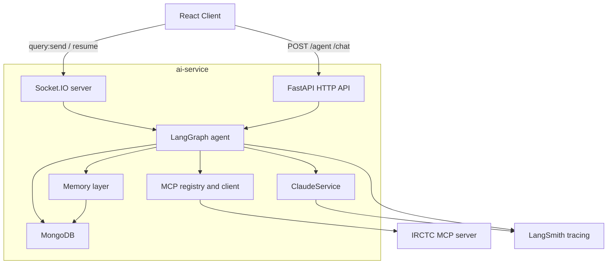
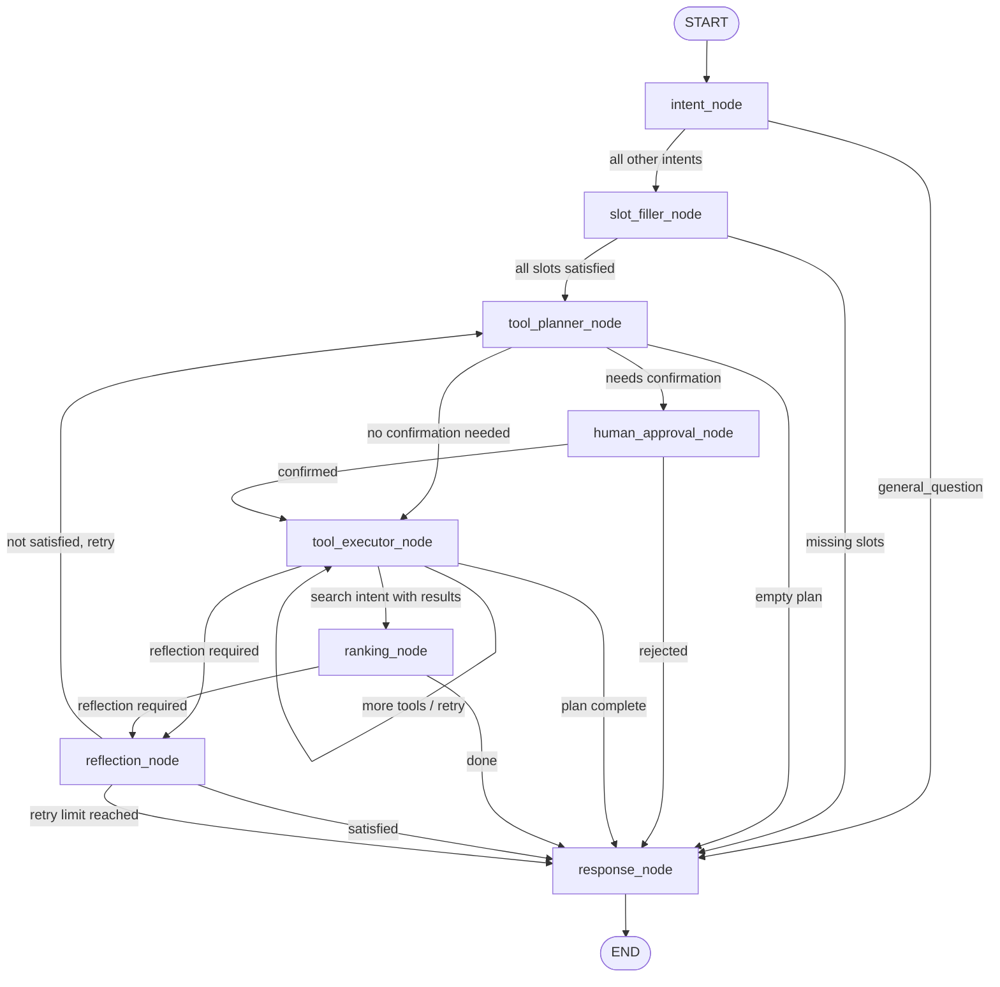

# ai-service

FastAPI + LangGraph orchestration layer for the IRCTC AI assistant. This service owns the AI runtime: intent classification, slot filling, MCP tool planning and execution, train ranking, human approval interrupts, reflection, conversation persistence, and Socket.IO streaming.

---

## Mental model

> Claude decides **what** to do. Python decides **how** to do it. MCP provides the live tool capabilities. LangGraph keeps the whole interaction stateful, resumable, and observable.

---

## Stack

| Layer | Technology |
|---|---|
| HTTP API | FastAPI |
| Realtime | python-socketio (AsyncServer, ASGI-mounted) |
| Orchestration | LangGraph (StateGraph + MongoDBSaver checkpointer) |
| LLM | Anthropic Claude via `anthropic` SDK |
| Tool protocol | MCP Streamable HTTP (JSON-RPC 2.0) |
| Database | MongoDB (Motor async + pymongo for checkpointer) |
| Tracing | LangSmith |
| Logging | Loguru |

---

## System architecture




---

## LangGraph flow

Built in [`app/graph/builder.py`](app/graph/builder.py). Every user message runs through this graph from `START` to `END`.



### Edge routing rules (exact code)

| From | Condition | To |
|---|---|---|
| `intent_node` | intent == `"general_question"` | `response_node` |
| `intent_node` | all other intents | `slot_filler_node` |
| `slot_filler_node` | `missing_slots` not empty | `response_node` |
| `slot_filler_node` | `missing_slots` empty | `tool_planner_node` |
| `tool_planner_node` | `tool_plan` empty | `response_node` |
| `tool_planner_node` | `confirmation_required` | `human_approval_node` |
| `tool_planner_node` | otherwise | `tool_executor_node` |
| `human_approval_node` | `confirmed` | `tool_executor_node` |
| `human_approval_node` | not confirmed | `response_node` |
| `tool_executor_node` | `retries > 0` or more tools | `tool_executor_node` (loop) |
| `tool_executor_node` | search intent + results | `ranking_node` |
| `tool_executor_node` | `reflection_required` | `reflection_node` |
| `tool_executor_node` | plan done | `response_node` |
| `ranking_node` | `reflection_required` | `reflection_node` |
| `ranking_node` | otherwise | `response_node` |
| `reflection_node` | `reflection_passed` | `response_node` |
| `reflection_node` | failed + `reflection_retries < 1` | `tool_planner_node` |
| `reflection_node` | failed + `reflection_retries >= 1` | `response_node` |


---

## Node reference

### `intent_node`
**File:** `app/graph/nodes/intent_node.py`

The entry point for every turn. Calls Claude with the `classify_intent` tool (forced tool-use, `temperature=0`) to extract:

- `intent` — one of 30 enum values (see list below)
- `user_goal` — one-sentence summary
- Travel entities: `from_station`, `to_station`, `date`, `travel_class`, `quota`, `train_number`, `pnr`, `selected_passenger_names`

After classification it:
1. Normalises station names to IRCTC codes using a built-in city → code map (e.g. `"mumbai"` → `"BCT"`)
2. Normalises date strings to ISO `YYYY-MM-DD` (handles "tomorrow", "next week", "23rd July 2026", etc.)
3. Resolves `selected_passenger_names` against `saved_passengers` in state
4. Merges `user_preferences` into travel context (preferred class, quota)
5. Resets all per-turn working state via `reset_turn_state()`

**Supported intents:**

| Category | Intents |
|---|---|
| Search | `search_trains`, `recommend_trains`, `check_availability`, `get_fare` |
| Train info | `get_route`, `get_train_schedule`, `get_live_status`, `get_platform`, `get_seat_map`, `get_boarding_points`, `search_train_by_number` |
| Station | `search_stations`, `find_station_code`, `get_nearby_stations` |
| Reference | `list_classes`, `list_quotas` |
| Booking | `book_ticket`, `cancel_ticket`, `get_pnr`, `get_booking`, `get_booking_history`, `update_booking_status`, `update_boarding_point` |
| Reminders | `create_reminder`, `get_reminders`, `update_reminder`, `delete_reminder` |
| Passengers | `add_saved_passenger`, `get_saved_passengers` |
| Fallback | `general_question` |

---

### `slot_filler_node`
**File:** `app/graph/nodes/slot_filler_node.py`

Checks whether the primary tool's required inputs are satisfied before planning starts. Uses the **live MCP tool schema** (discovered at startup) not hardcoded lists. Falls back to static `TOOL_PRECONDITIONS` if discovery hasn't run.

Philosophy — auto-resolve first, ask last:
- `quota` → always satisfied (default `GN` applied later by arg_patcher)
- `train_number` → satisfied if search results are already in state, or if from/to/date allow a search first
- Only genuinely unknown user-facing fields produce a clarification question
- One question per turn, phrased from the schema description when possible

Askable slots: `from_station`, `to_station`, `date`, `travel_class`, `train_number`, `pnr`

---

### `tool_planner_node`
**File:** `app/graph/nodes/tool_planner_node.py`

Calls Claude with the `create_tool_plan` tool (forced tool-use, `temperature=0`, `max_tokens=2048`) to produce an ordered list of `{tool, args}` steps.

Key behaviours:
- The full live MCP tool list is passed as additional tools with `cache_control: ephemeral` on the last entry (prompt caching)
- The system prompt is cached with `cache_system=True`
- Reflection feedback from a previous retry is injected into the context
- Sets `confirmation_required=True` if any step has `requires_confirmation` in its precondition
- Sets `reflection_required=True` for data-heavy intents (search, availability, fare, booking, PNR history) — capped at 1 retry

**Planner rules the system prompt enforces:**
- Use station codes, not city names
- Never repeat already-cached steps (search_results, fare, availability in state)
- Booking chain: `search_trains → check_availability → get_fare → book_ticket`
- Live status chain: `search_train_by_number → get_live_status`
- `check_availability`, `get_fare`, `get_live_status` share `parallel_group="post_search"` and run concurrently
- Auto-fetch saved passengers before `book_ticket` if not in context
- To update/delete a reminder: `get_reminders` first to get the `reminderId`


---

### `human_approval_node`
**File:** `app/graph/nodes/human_approval_node.py`

Pauses graph execution using `langgraph.types.interrupt()`. The graph checkpoint is saved to MongoDB so the pause survives process restarts.

Destructive actions that trigger this node (from `TOOL_PRECONDITIONS`):
`book_ticket`, `cancel_ticket`, `update_booking_status`, `update_boarding_point`, `delete_reminder`

The confirmation prompt is built from live state: shows train, route, date, class, fare, and passengers for bookings; PNR for cancellations. Resume value can be `bool` or string (`"yes"`, `"y"`, `"confirm"`, etc.).

---

### `tool_executor_node`
**File:** `app/graph/nodes/tool_executor_node.py`

Executes one tool per graph invocation (loops via edge routing until `current_tool_index >= len(tool_plan)`).

**Sequential execution:**
1. `patch_tool_args()` re-resolves args from live state before every call — so `book_ticket` always gets the real train number from `search_results`, not a planner guess
2. Executes via `MCPToolRegistry.execute()` with a per-tool timeout (`asyncio.wait_for`)
3. On error: retries up to `max_retries` times (not for `INVALID_PARAMETERS` / `UNKNOWN_TOOL`)
4. After a permanent failure before a destructive step: aborts the rest of the plan

**Parallel execution:**
Tools sharing the same `parallel_group` tag (e.g. `"post_search"`) are detected automatically and fired with `asyncio.gather`. A failed tool in a parallel group aborts any downstream destructive step.

**Result dispatch** — `_apply_result()` routes each tool's output to the correct state field:

| Tool(s) | State field |
|---|---|
| `search_trains`, `recommend_trains` | `search_results` + `travel.train_number` |
| `check_availability` | `availability` |
| `get_fare` | `fare` |
| `book_ticket`, `cancel_ticket`, `get_booking`, `get_pnr`, `update_*` | `booking` + `travel.pnr` |
| `get_booking_history` | `tool_results["get_booking_history"]` |
| `get_reminders` | `reminders` |
| `list_classes`, `list_quotas` | `tool_results[tool_name]` |
| `get_saved_passengers` | `saved_passengers` |
| `find_station_code` | `travel.from_station` or `to_station` + `tool_results` |
| everything else | `tool_results[tool_name]` |

---

### `ranking_node`
**File:** `app/graph/nodes/ranking_node.py`

Pure Python, no Claude. Triggered only for `search_trains` and `recommend_trains` intents when `search_results` is non-empty.

Detects ranking mode from `user_goal` keywords:

| Mode | Trigger keywords | Sort key |
|---|---|---|
| `fastest` | fast, quick, shortest, direct, less time | `durationMins` / `duration` asc |
| `best_avail` | available, seats, confirm, confirmed | seats desc → fare asc |
| `cheapest` (default) | cheap, budget, affordable, low fare | fare asc |

Handles both flat and nested fare/availability shapes from the MCP server. Trains with unparseable sort fields keep their original relative position (stable sort with sentinel).

Writes `ranked_results` to state. `response_node` uses this instead of `search_results`.

---

### `reflection_node`
**File:** `app/graph/nodes/reflection_node.py`

Quality-check step. Only runs when `reflection_required=True` (set by `tool_planner_node` for data-heavy intents). Hard-capped at 1 retry cycle (`reflection_retries`).

**Pre-gate (deterministic, no Claude):** If any tool has `status=failed/error` or `errors` is non-empty, immediately marks `reflection_passed=False` with that error as feedback. Claude is not called.

**Claude call:** Passes `tool_history` summary and `user_goal` to the `reflect_on_results` tool (forced tool-use). Returns `{satisfied: bool, feedback: str}`.

- `satisfied=True` → routes to `response_node`
- `satisfied=False` → sets `reflection_feedback` and routes back to `tool_planner_node` for one replanning attempt
- Any exception in reflection → fails open (`reflection_passed=True`) so it never blocks a response

---

### `response_node`
**File:** `app/graph/nodes/response_node.py`

Final response generation. Calls Claude (`temperature=0.7`, `max_tokens=2048`, `cache_system=True`) with:
- Windowed conversation history (last 20 messages via `format_for_claude`)
- `[Tool Results]` block appended to the last user message (built by `build_tool_context`)
- Reflection feedback as a `[Quality note]` hint if present
- Uses `ranked_results` in place of `search_results` when available

**PNR grounding:** After generation, `_ground_response()` scans the reply for 10-digit numbers. Any PNR not present verbatim in `booking`, `travel`, or `tool_results` is replaced with `[PNR unavailable]`. Prevents hallucinated PNRs.


---

## Graph state (`TravelState`)

**File:** `app/graph/state.py`

The full state schema. All fields are `Optional` except `messages`.

```
TravelState
├── Conversation
│   ├── messages              List[BaseMessage]  — append-only via add_messages reducer
│   ├── conversation_id       str
│   └── turn_count            int
│
├── Intent & Planning
│   ├── intent                str  — one of 30 enum values
│   └── user_goal             str  — one-sentence summary
│
├── Travel Context            (persists across turns via checkpointer)
│   └── travel: TravelContext
│       ├── from_station, to_station, date
│       ├── travel_class, quota
│       ├── train_number, train_name, pnr
│       └── selected_passengers
│
├── Tool Results
│   ├── search_results        List[dict]
│   ├── selected_train        dict
│   ├── availability          dict
│   ├── fare                  dict
│   ├── booking               dict
│   ├── reminders             List[dict]
│   ├── saved_passengers      List[dict]
│   ├── passengers            List[dict]
│   └── tool_results          Dict[str, Any]  — generic bucket for everything else
│
├── Slot Filling
│   ├── missing_slots         List[str]
│   └── pending_question      str
│
├── Tool Execution
│   ├── tool_plan             List[str]
│   ├── tool_plan_args        List[dict]
│   ├── tool_history          List[ToolCall]
│   ├── current_tool_index    int
│   └── parallel_results      Dict[str, Any]
│
├── Reflection
│   ├── reflection_required   bool
│   ├── reflection_passed     bool
│   ├── reflection_feedback   str
│   └── reflection_retries    int
│
├── Ranking
│   └── ranked_results        List[dict]
│
├── Human Approval
│   ├── confirmation_required bool
│   ├── confirmation_prompt   str
│   └── confirmed             bool
│
├── Error / Retry
│   ├── retries               int
│   └── errors                List[str]
│
├── User Identity
│   ├── user_email            str
│   └── user_name             str
│
├── User Preferences (long-lived)
│   └── user_preferences: UserPreferences
│       ├── preferred_class, preferred_quota
│       ├── berth_preference
│       └── senior_citizen
│
└── Execution Metrics
    └── execution_metrics: ExecutionMetrics
        ├── turn_start_time, tools_called
        ├── total_latency_ms
        └── claude_calls
```


---

## MCP layer

### Tool discovery (`app/mcp/discovery.py`)
At startup `MCPDiscovery.discover()` calls `tools/list` on the MCP server using a probe user email. Tools are normalised to Anthropic tool format (`input_schema` camelCase → snake_case). The registry is refreshed lazily if a tool call references an unknown tool name.

### Tool registry (`app/mcp/registry.py`)
`MCPToolRegistry.execute()` is the single call point from the graph:
1. Checks `_discovery.is_known(tool_name)` — triggers refresh if not
2. Strips hallucinated args not in the tool's schema properties
3. Validates required fields — returns `INVALID_PARAMETERS` error without calling MCP if missing
4. Calls `MCPClient.call_tool()` and returns `json.dumps(result.to_dict())`

### MCP client (`app/mcp/client.py`)
- One `MCPSession` per `user_email` (holds `mcp-session-id` header)
- `_ensure_initialized()` sends the `initialize` + `notifications/initialized` handshake on first use
- `call_tool()` retries up to 3 times with backoff `[0.5s, 1.0s, 2.0s]`
- `MCPSessionError` / `MCPConnectionError` → session reset + retry
- Non-retryable errors (`MCPToolNotFoundError`, `MCPInvalidResponseError`, `MCPAuthError`) → immediate `ToolResult(success=False)`

### Transport (`app/mcp/transport.py`)
`POST /mcp` with `Content-Type: application/json` and headers:
- `x-user-email` (required)
- `x-user-name` (optional)
- `mcp-session-id` (once established)

Parses both plain JSON and `data: ...` SSE-framed responses. Maps HTTP 401/403/404/5xx to typed `MCPError` subclasses.

### Arg patcher (`app/graph/arg_patcher.py`)
Re-resolves tool arguments from live state immediately before execution. Only fills blanks — never overwrites values the planner set. Bridges snake_case travel context to camelCase MCP schemas (e.g. `from_station` → `fromStation`).

---

## Tool preconditions

**File:** `app/graph/tool_preconditions.py`

29 tools are registered with:
- `required_slots` — what the slot filler checks
- `requires_confirmation` — whether `human_approval_node` fires
- `max_retries` — per-tool retry budget in the executor
- `cacheable` / `cache_key` — metadata (informational, not yet enforced in executor)
- `parallel_group` — tools sharing a tag run concurrently (`"post_search"`: `check_availability`, `get_fare`, `get_live_status`)
- `timeout_seconds` — per-tool `asyncio.wait_for` timeout

Tools requiring confirmation: `book_ticket`, `cancel_ticket`, `update_booking_status`, `update_boarding_point`, `delete_reminder`


---

## Memory layers

### Layer 1 — Conversation window (`app/memory/conversation_memory.py`)
`format_for_claude()` applies a sliding window of 20 messages (10 turns) before every Claude call. Always anchors the first `HumanMessage` for context, trims from the middle. Skips `ToolMessage` entries — those surface through `build_tool_context` instead.

### Layer 2 — Conversation persistence (`app/services/conversation_manager.py`)
`ConversationManager` owns the full lifecycle:

| Method | What it does |
|---|---|
| `open(conversation_id, user_email)` | Load or create conversation doc; load `UserPreferences` from DB; return both |
| `save_turn(...)` | Upsert conversation, increment turn counter, save user + assistant messages, save `ExecutionLogDoc`; trigger summary every 10 turns |
| `summarize(conversation_id)` | Rolling Claude-generated summary (max 200 words, replaces previous); no-op if `claude_service` is None |
| `build_context(conversation_id)` | Returns `{summary, messages, turn_count}` for resume flows |
| `close(user_email, prefs)` | Persist updated `UserPreferences` back to MongoDB |
| `get_history` / `get_recent` | Query helpers for the REST API |

### Layer 3 — User preferences (`app/memory/preference_memory.py`)
Loaded at `conversation_manager.open()` and seeded into `state["user_preferences"]`. `intent_node` merges them into travel context each turn (preferred class, quota). Persisted back at `close()` when preferences change.

### Checkpointing (`app/memory/checkpoints.py`)
`MongoDBSaver` (from `langgraph-checkpoint-mongodb`) using a dedicated sync `pymongo` client. LangGraph's async interface offloads blocking pymongo calls to a thread executor. Enables `interrupt()` / `Command(resume=...)` across process restarts.

### Context builder (`app/memory/context_builder.py`)
Two functions:
- `build_tool_context(state)` — builds the `[Tool Results]` block for `response_node` (search results, availability, fare, booking, reminders, saved passengers, generic tool_results, errors)
- `build_planner_context(state, tools_summary)` — builds the full context message for `tool_planner_node` (intent, goal, travel context, all cached results, preferences, turn count, available tools summary)

---

## Request lifecycle

### Socket.IO path (primary)

```
client  →  query:send {id, content}
server  →  query:ack  {id}
server  →  agent:typing {isTyping: true}
server  →  tool:start {tool, index, total}   (per tool, from astream_events)
server  →  tool:done  {tool, index}          (on success)
server  →  tool:failed {tool, index, error}  (on failure)
server  →  message:chunk {id, delta}         (4-char chunks, 10ms apart)
server  →  message:complete {message}
server  →  agent:typing {isTyping: false}
```

On interrupt (destructive action pending confirmation):
```
server  →  agent:interrupt {id, prompt}
client  →  resume {id, approved: bool}
server  →  [continues from checkpoint]
server  →  message:complete {message}
```

Tool progress events are derived from `astream_events(version="v2")` — the manager tracks `tool_planner_node` output to know the plan, then emits start/done/failed as `tool_executor_node` chain events fire.

### HTTP path

- `POST /api/v1/agent` — full graph run, returns final state summary as JSON
- `POST /api/v1/chat` — plain Claude call via `ChatService`, no graph
- `POST /api/v1/chat/stream` — SSE streaming Claude call via `ChatService`

Resume via HTTP: send `{resume: true, resume_value: bool, conversation_id: ...}` — calls `agent_graph.ainvoke(Command(resume=resume_value), config)`.


---

## API reference

All REST endpoints are under `/api/v1`.

### Health
- `GET /api/v1/health` — liveness probe, returns `{status, environment}`

### Chat (no graph)
- `POST /api/v1/chat` — plain Claude response (`ChatRequest` → `ChatResponse`)
- `POST /api/v1/chat/stream` — SSE streaming Claude response

### Agent (full graph)
- `POST /api/v1/agent` — run or resume the LangGraph agent

`AgentRequest` fields:

| Field | Type | Purpose |
|---|---|---|
| `message` | `str` | User message (empty string ok for resume) |
| `conversation_id` | `str?` | Thread ID for checkpointer |
| `user_email` | `str?` | Used for MCP auth headers and preference loading |
| `user_name` | `str?` | Passed to MCP and stored in conversation |
| `resume` | `bool` | `true` to resume an interrupt |
| `resume_value` | `bool?` | Approval decision for the interrupt |
| `travel_context` | `dict?` | Seed `state.travel` on first message |
| `search_results` | `list?` | Pre-seed results (skip search) |
| `selected_train` | `dict?` | Pre-selected train |
| `availability` | `dict?` | Pre-fetched availability |
| `fare` | `dict?` | Pre-fetched fare |
| `passengers` | `list?` | Passenger list |
| `booking` | `dict?` | Existing booking context |

Response includes: `message`, `intent`, `travel_context`, `search_results`, `selected_train`, `availability`, `fare`, `booking`, `confirmation_required`, `confirmation_prompt`, `interrupted`, `errors`

### Conversations
- `GET /api/v1/conversations/{id}/messages?limit=50` — message history
- `GET /api/v1/conversations/{id}/context` — summary + recent messages for resume
- `GET /api/v1/conversations/user/{email}?limit=20` — recent conversations
- `POST /api/v1/conversations/{id}/summarize` — manually trigger rolling summary

---

## Socket.IO events

Defined in `app/websocket/events.py`.

**Client → server:** `query:send`, `resume`

**Server → client:** `query:ack`, `agent:typing`, `tool:start`, `tool:done`, `tool:failed`, `message:chunk`, `message:complete`, `message:error`, `agent:interrupt`

CORS origins configured: `http://localhost:3000`, `http://localhost:3001`

JWT auth: the `connect` event reads `auth.token`, verifies it with `jwt_secret`, extracts `email` and `name`. Falls back to `auth.userEmail` / `auth.userName` if no token.


---

## Project layout

```
ai-service/
├── app/
│   ├── main.py                  ASGI entrypoint — FastAPI + Socket.IO mount, CORS, logging
│   ├── api/
│   │   ├── routes.py            Central router aggregating all sub-routers
│   │   ├── chat.py              POST /chat, /chat/stream, /agent
│   │   ├── conversations.py     GET/POST conversation history endpoints
│   │   ├── health.py            GET /health
│   │   └── dependencies.py      FastAPI dependency injection (services, graph, db, registry)
│   ├── auth/
│   │   ├── jwt.py               verify_jwt, extract_user_from_token
│   │   └── current_user.py      CurrentUser dataclass
│   ├── config/
│   │   ├── settings.py          Pydantic BaseSettings, get_settings() lru_cache
│   │   └── constants.py         App-level string constants
│   ├── core/
│   │   ├── lifespan.py          Startup/shutdown: Claude, MCP, MongoDB, checkpointer, graph, Socket.IO
│   │   ├── exceptions.py        BaseAPIException hierarchy
│   │   └── handlers.py          FastAPI exception handlers
│   ├── db/
│   │   ├── models.py            Pydantic docs: MessageDoc, ConversationDoc, UserPreferenceDoc, ExecutionLogDoc
│   │   ├── mongo.py             Motor client factory
│   │   └── repositories/
│   │       ├── conversation_repo.py
│   │       ├── preference_repo.py
│   │       └── execution_repo.py
│   ├── graph/
│   │   ├── state.py             TravelState TypedDict (full schema)
│   │   ├── builder.py           create_agent_graph() — wires nodes + edges + checkpointer
│   │   ├── edges.py             7 conditional edge routing functions
│   │   ├── interrupts.py        HUMAN_APPROVAL_NODES set derived from TOOL_PRECONDITIONS
│   │   ├── tool_preconditions.py  ToolPrecondition dataclass + TOOL_PRECONDITIONS dict (29 tools)
│   │   ├── arg_patcher.py       patch_tool_args() — deterministic arg resolution from live state
│   │   └── nodes/
│   │       ├── intent_node.py
│   │       ├── slot_filler_node.py
│   │       ├── tool_planner_node.py
│   │       ├── tool_executor_node.py
│   │       ├── human_approval_node.py
│   │       ├── ranking_node.py
│   │       ├── reflection_node.py
│   │       ├── response_node.py
│   │       └── planner_node.py  (backward-compat re-export of intent_node)
│   ├── mcp/
│   │   ├── client.py            MCPClient — session management, retry, JSON-RPC
│   │   ├── discovery.py         MCPDiscovery — startup tool list fetch + cache
│   │   ├── registry.py          MCPToolRegistry — arg validation + execute bridge
│   │   ├── transport.py         MCPTransport — HTTP POST /mcp, SSE parsing, session cleanup
│   │   ├── normalizer.py        ToolResult dataclass + normalize_mcp_response()
│   │   ├── session.py           MCPSession dataclass (per-user session state + metrics)
│   │   └── exceptions.py        MCPError hierarchy (Connection, Timeout, Session, Auth, Schema)
│   ├── memory/
│   │   ├── checkpoints.py       MongoDBSaver factory
│   │   ├── context_builder.py   build_tool_context(), build_planner_context()
│   │   ├── conversation_memory.py  Sliding window + format_for_claude()
│   │   ├── preference_memory.py    load/persist/merge user preferences
│   │   └── working_memory.py    get_working_snapshot(), reset_turn_state(), increment_tool_metric()
│   ├── schemas/
│   │   ├── chat.py              ChatRequest, ChatResponse, AgentRequest, UsageInfo
│   │   ├── errors.py            ErrorDetail, ErrorResponse
│   │   └── health.py            HealthResponse
│   ├── services/
│   │   ├── claude.py            ClaudeService — chat_raw(), stream_chat(), close()
│   │   ├── chat.py              ChatService — send_message(), stream_message()
│   │   └── conversation_manager.py  ConversationManager lifecycle
│   ├── telemetry/
│   │   └── logging.py           Loguru setup, InterceptHandler, app_logger
│   ├── types/
│   │   └── chat.py              build_complete_message() for Socket.IO message:complete
│   └── websocket/
│       ├── manager.py           Socket.IO event handlers + _run_graph() + _stream_chunks()
│       ├── connections.py       SocketSession dataclass + in-memory session store
│       └── events.py            Event name constants
├── tests/
│   ├── test_arg_patcher.py
│   ├── test_preferences.py
│   ├── test_ranking.py
│   ├── test_reflection_and_grounding.py
│   └── test_slot_filler.py
├── pyproject.toml
├── .env.example
└── README.md
```


---

## Configuration

All settings in `app/config/settings.py` via `pydantic-settings` (reads `.env`).

| Variable | Required | Default | Notes |
|---|---|---|---|
| `ANTHROPIC_API_KEY` | ✅ | — | Must start with `sk-ant` |
| `ANTHROPIC_DEFAULT_MODEL` | | `claude-haiku-4-5` | |
| `APP_NAME` | | `ai-service` | |
| `APP_ENV` | | `development` | Set to `production` for JSON logging + hidden docs |
| `DEBUG` | | `false` | Enables uvicorn hot-reload |
| `LOG_LEVEL` | | `INFO` | |
| `MCP_SERVER_URL` | | `http://localhost:3000` | Base URL of the IRCTC MCP server |
| `MCP_SERVER_TIMEOUT` | | `30.0` | HTTP timeout for MCP requests (seconds) |
| `MONGO_URL` | | `mongodb://localhost:27017` | |
| `MONGO_DB` | | `irctc_ai` | |
| `JWT_SECRET` | | `change-me` | ⚠️ Logs a warning if left as default — set a strong secret |
| `JWT_ALGORITHM` | | `HS256` | |
| `LANGSMITH_TRACING` | | `true` | Set to `false` to disable |
| `LANGSMITH_API_KEY` | | — | Required for tracing |
| `LANGSMITH_PROJECT` | | `default` | |
| `LANGSMITH_ENDPOINT` | | `https://api.smith.langchain.com` | |

---

## Running locally

```bash
# Install dependencies
pip install -e ".[dev]"

# Copy and fill environment variables
cp .env.example .env

# Start the service (Socket.IO + FastAPI on port 8000)
uvicorn app.main:app --reload
```

With Docker Compose (from repo root):

```bash
docker compose up --build ai-service
```

The service requires MongoDB and the IRCTC MCP server to be reachable. MCP tool discovery runs at startup with 5 attempts and exponential backoff. If discovery fails the service still starts and retries lazily on the first tool call.

---

## Development notes

- `app/main.py` — ASGI entrypoint: `socketio.ASGIApp(sio, other_asgi_app=_fastapi_app)`. The Socket.IO server is mounted as a sub-ASGI app so both share one port.
- `app/core/lifespan.py` — startup order matters: Claude → MCP transport → MCP discovery → MongoDB → checkpointer → graph compile → ConversationManager → Socket.IO manager wiring.
- `app/graph/builder.py` — adding a new node requires: adding to `StateGraph`, adding a conditional edge, and exporting from `app/graph/nodes/__init__.py`.
- `app/graph/tool_preconditions.py` — adding a new MCP tool: add a `ToolPrecondition` entry here; slot filler and executor will pick it up automatically.
- Reflection is intentionally capped at 1 retry (`reflection_retries >= 1` → always route to `response_node`). To increase it, change the cap in both `tool_planner_node` and `edges.py`.
- The checkpointer uses sync pymongo. If you see checkpoint-related blocking, check thread pool saturation under high concurrency.
- LangSmith tracing wraps the Anthropic client via `langsmith.wrappers.wrap_anthropic` at startup. All Claude calls appear as child spans under the graph trace automatically.
