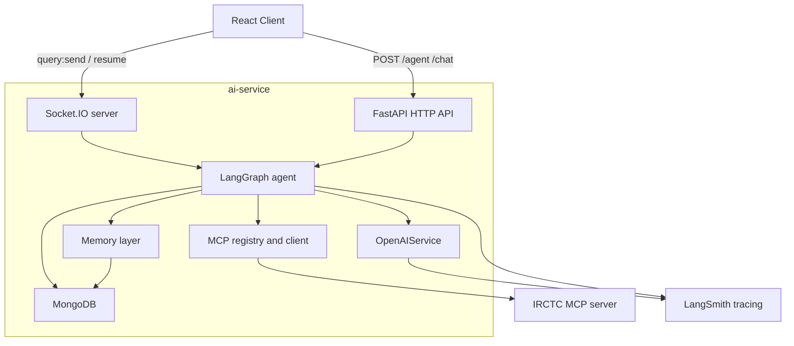
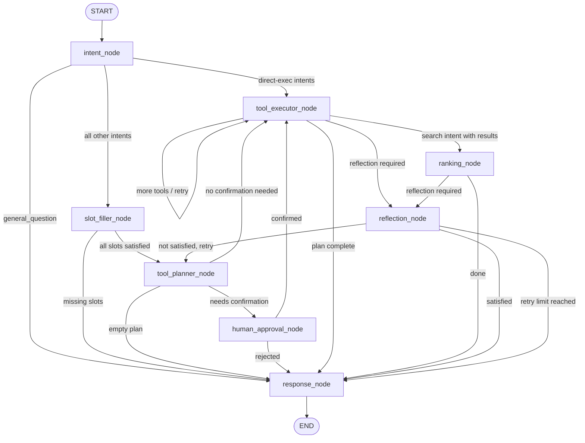

# ai-service

FastAPI + LangGraph orchestration layer for the IRCTC AI assistant. This service owns the AI runtime: intent classification, slot filling, MCP tool planning and execution, train ranking, human approval interrupts, reflection, conversation persistence, and Socket.IO streaming.

> **Status:** Fully migrated to OpenAI SDK. All modules verified and synced. Error handling hardened — no raw API errors leak to clients.

---

## Mental model

> OpenAI decides **what** to do. Python decides **how** to do it. MCP provides the live tool capabilities. LangGraph keeps the whole interaction stateful, resumable, and observable.

---

## Stack

| Layer | Technology |
|---|---|
| HTTP API | FastAPI |
| Realtime | python-socketio (AsyncServer, ASGI-mounted) |
| Orchestration | LangGraph (StateGraph + MongoDBSaver checkpointer) |
| LLM | OpenAI via `openai` SDK (`gpt-4o-mini` default) |
| Tool protocol | MCP Streamable HTTP (JSON-RPC 2.0) |
| Database | MongoDB (Motor async + pymongo for checkpointer) |
| Tracing | LangSmith (`wrap_openai`) |
| Logging | Loguru |

---

## System architecture



---

## LangGraph flow

Built in [`app/graph/builder.py`](app/graph/builder.py). Every user message runs through this graph from `START` to `END`.



### Edge routing rules

| From | Condition | To |
|---|---|---|
| `intent_node` | intent == `"general_question"` | `response_node` |
| `intent_node` | intent in direct-exec set¹ | `tool_executor_node` |
| `intent_node` | all other intents | `slot_filler_node` |
| `slot_filler_node` | `missing_slots` not empty | `response_node` |
| `slot_filler_node` | `missing_slots` empty | `tool_planner_node` |
| `tool_planner_node` | `tool_plan` empty | `response_node` |
| `tool_planner_node` | `confirmation_required` | `human_approval_node` |
| `tool_planner_node` | otherwise | `tool_executor_node` |
| `human_approval_node` | `confirmed` | `tool_executor_node` |
| `human_approval_node` | not confirmed | `response_node` |
| `tool_executor_node` | `retries > 0` or more tools | `tool_executor_node` (loop) |
| `tool_executor_node` | search intent + results | `ranking_node` |
| `tool_executor_node` | `reflection_required` | `reflection_node` |
| `tool_executor_node` | plan done | `response_node` |
| `ranking_node` | `reflection_required` | `reflection_node` |
| `ranking_node` | otherwise | `response_node` |
| `reflection_node` | `reflection_passed` | `response_node` |
| `reflection_node` | failed + `reflection_retries < 1` | `tool_planner_node` |
| `reflection_node` | failed + `reflection_retries >= 1` | `response_node` |

¹ **Direct-exec intents** bypass `slot_filler_node` and `tool_planner_node` entirely: `get_saved_passengers`, `get_booking_history`, `get_reminders`, `list_classes`, `list_quotas`.

---

## Node reference

### `intent_node`
**File:** `app/graph/nodes/intent_node.py`

Calls OpenAI with the `classify_intent` function tool (forced tool-use, `temperature=0`) to extract:

- `intent` — one of 30 enum values
- `user_goal` — one-sentence summary
- Travel entities: `from_station`, `to_station`, `date`, `travel_class`, `quota`, `train_number`, `pnr`, `selected_passenger_names`

After classification it:
1. Normalises station names to IRCTC codes (`"mumbai"` → `"BCT"`, etc.)
2. Normalises date strings to ISO `YYYY-MM-DD` (handles "tomorrow", "next week", "23rd July 2026", etc.)
3. Resolves `selected_passenger_names` against `saved_passengers` in state
4. Merges `user_preferences` into travel context
5. Resets per-turn working state via `reset_turn_state()`
6. For direct-exec intents — pre-populates `tool_plan = [intent]`, `tool_plan_args = [{}]`, routes straight to `tool_executor_node`

**Supported intents:**

| Category | Intents |
|---|---|
| Search | `search_trains`, `recommend_trains`, `check_availability`, `get_fare` |
| Train info | `get_route`, `get_train_schedule`, `get_live_status`, `get_platform`, `get_seat_map`, `get_boarding_points`, `search_train_by_number` |
| Station | `search_stations`, `find_station_code`, `get_nearby_stations` |
| Reference | `list_classes`, `list_quotas` |
| Booking | `book_ticket`, `cancel_ticket`, `get_pnr`, `get_booking`, `get_booking_history`, `update_booking_status`, `update_boarding_point` |
| Reminders | `create_reminder`, `get_reminders`, `update_reminder`, `delete_reminder` |
| Passengers | `add_saved_passenger`, `get_saved_passengers` |
| Fallback | `general_question` |

---

### `slot_filler_node`
**File:** `app/graph/nodes/slot_filler_node.py`

Checks whether the primary tool's required inputs are satisfied before planning. Uses the **live MCP tool schema** (discovered at startup). Falls back to static `TOOL_PRECONDITIONS` if discovery hasn't run.

Philosophy — auto-resolve first, ask last:
- `quota` → always satisfied (default `GN` applied by arg_patcher)
- `train_number` → satisfied if in travel context, search results, or **booking history in state**
- `from_station`, `date` → satisfied if in travel context or **carried-forward booking history**
- Only genuinely unknown user-facing fields produce a clarification question
- One question per turn

Askable slots: `from_station`, `to_station`, `date`, `travel_class`, `train_number`, `pnr`

---

### `tool_planner_node`
**File:** `app/graph/nodes/tool_planner_node.py`

Calls OpenAI with the `create_tool_plan` function tool (forced tool-use, `temperature=0`, `max_tokens=2048`) to produce an ordered list of `{tool, args}` steps.

Key behaviours:
- Full live MCP tool list passed as additional OpenAI function tools
- Cross-turn context (booking history, saved passengers) explicitly shown in planner prompt
- Reflection feedback from a previous retry injected into context
- Sets `confirmation_required=True` if any step has `requires_confirmation`
- Sets `reflection_required=True` for data-heavy intents (capped at 1 retry)

**Planner rules:**
- Use station codes not city names
- Never repeat already-cached steps
- Booking chain: `search_trains → check_availability → get_fare → book_ticket`
- Live status chain: `search_train_by_number → get_live_status`
- `check_availability`, `get_fare`, `get_live_status` run concurrently (parallel group)
- Auto-fetch saved passengers before `book_ticket` if not in context
- Extract `trainNumber`/`pnr` from booking history in context — never ask user for data already fetched

---

### `human_approval_node`
**File:** `app/graph/nodes/human_approval_node.py`

Pauses graph execution using `langgraph.types.interrupt()`. Checkpoint saved to MongoDB — survives process restarts.

Destructive actions that trigger this: `book_ticket`, `cancel_ticket`, `update_booking_status`, `update_boarding_point`, `delete_reminder`

---

### `tool_executor_node`
**File:** `app/graph/nodes/tool_executor_node.py`

Executes one tool per graph invocation (loops until `current_tool_index >= len(tool_plan)`).

**Sequential execution:**
1. `patch_tool_args()` re-resolves args from live state — including **booking history** for tools like `get_boarding_points`, `get_live_status`, `cancel_ticket`
2. Executes via `MCPToolRegistry.execute()` with per-tool timeout
3. Retries up to `max_retries` (not for `INVALID_PARAMETERS` / `UNKNOWN_TOOL`)
4. Aborts plan after permanent failure before a destructive step

**Parallel execution:** Tools sharing a `parallel_group` tag fire with `asyncio.gather`.

**Result dispatch — `_apply_result()`:**

| Tool(s) | State field | Notes |
|---|---|---|
| `search_trains`, `recommend_trains` | `search_results` + `travel.train_number` | Slimmed — schedule/route arrays stripped |
| `check_availability` | `availability` | |
| `get_fare` | `fare` | |
| `book_ticket`, `cancel_ticket`, `get_booking`, `get_pnr`, `update_*` | `booking` + `travel.pnr` | |
| `get_booking_history` | `tool_results["get_booking_history"]` | Slimmed to 9 key fields — persists across turns |
| `get_reminders` | `reminders` + `tool_results["get_reminders"]` | Dual-stored — persists across turns |
| `get_saved_passengers` | `saved_passengers` + `tool_results["get_saved_passengers"]` | Dual-stored — persists across turns |
| `list_classes`, `list_quotas` | `tool_results[tool_name]` | |
| `find_station_code` | `travel.from_station` or `to_station` + `tool_results` | |
| everything else | `tool_results[tool_name]` | Cleared next turn |

---

### `ranking_node`
**File:** `app/graph/nodes/ranking_node.py`

Pure Python, no LLM. Triggered for `search_trains` / `recommend_trains` when results are present.

| Mode | Trigger keywords | Sort key |
|---|---|---|
| `fastest` | fast, quick, shortest, direct | `durationMins` asc |
| `best_avail` | available, seats, confirm | seats desc → fare asc |
| `cheapest` (default) | cheap, budget, low fare | fare asc |

Writes `ranked_results`. `response_node` uses this instead of `search_results`.

---

### `reflection_node`
**File:** `app/graph/nodes/reflection_node.py`

Quality-check step. Only runs when `reflection_required=True`. Hard-capped at 1 retry.

- **Pre-gate (deterministic):** If any tool failed, marks `reflection_passed=False` without calling OpenAI
- **OpenAI call:** `reflect_on_results` function tool — returns `{satisfied, feedback}`
- `satisfied=False` → sets `reflection_feedback` → routes back to `tool_planner_node`
- Any exception → fails open (`reflection_passed=True`) — never blocks a response

---

### `response_node`
**File:** `app/graph/nodes/response_node.py`

Final response generation. Calls OpenAI (`temperature=0.7`, `max_tokens=2048`) with:
- Windowed conversation history (last 20 messages via `format_messages`)
- `[Tool Results]` block appended to the last user message
- Reflection feedback as `[Quality note]` hint if present
- Uses `ranked_results` in place of `search_results` when available

**PNR grounding:** `_ground_response()` scans the reply for 10-digit numbers. Any PNR not present verbatim in state data is replaced with `[PNR unavailable]`.

---

## Graph state (`TravelState`)

**File:** `app/graph/state.py`

```
TravelState
├── Conversation
│   ├── messages              List[BaseMessage]  — append-only via add_messages reducer
│   ├── conversation_id       str
│   └── turn_count            int
│
├── Intent & Planning
│   ├── intent                str  — one of 30 enum values
│   └── user_goal             str  — one-sentence summary
│
├── Travel Context            (always persists via checkpointer)
│   └── travel: TravelContext
│       ├── from_station, to_station, date
│       ├── travel_class, quota
│       ├── train_number, train_name, pnr
│       └── selected_passengers
│
├── Tool Results
│   ├── search_results        List[dict]  — slimmed, cleared on new search intent
│   ├── selected_train        dict
│   ├── availability          dict        — cleared on new search intent
│   ├── fare                  dict        — cleared on new search intent
│   ├── booking               dict        — cleared each turn
│   ├── reminders             List[dict]  — cleared each turn
│   ├── saved_passengers      List[dict]  — persists for session lifetime
│   ├── passengers            List[dict]
│   └── tool_results          Dict[str, Any]
│       ├── get_booking_history  → persists across turns (slimmed)
│       ├── get_saved_passengers → persists across turns
│       ├── get_reminders        → persists across turns
│       └── <other tools>        → cleared each turn (route, live_status, etc.)
│
├── Slot Filling
│   ├── missing_slots         List[str]
│   └── pending_question      str
│
├── Tool Execution
│   ├── tool_plan             List[str]
│   ├── tool_plan_args        List[dict]
│   ├── tool_history          List[ToolCall]
│   ├── current_tool_index    int
│   └── parallel_results      Dict[str, Any]
│
├── Reflection
│   ├── reflection_required   bool
│   ├── reflection_passed     bool
│   ├── reflection_feedback   str
│   └── reflection_retries    int
│
├── Ranking
│   └── ranked_results        List[dict]
│
├── Human Approval
│   ├── confirmation_required bool
│   ├── confirmation_prompt   str
│   └── confirmed             bool
│
├── Error / Retry
│   ├── retries               int
│   └── errors                List[str]
│
├── User Identity
│   ├── user_email            str
│   └── user_name             str
│
├── User Preferences (long-lived)
│   └── user_preferences: UserPreferences
│       ├── preferred_class, preferred_quota
│       ├── berth_preference, senior_citizen
│
└── Execution Metrics
    └── execution_metrics: ExecutionMetrics
        ├── turn_start_time, tools_called
        ├── total_latency_ms, llm_calls
```

### State lifecycle rules

| Field | Lifecycle |
|---|---|
| `messages` | Accumulates via `add_messages` reducer — windowed to 20 before LLM calls |
| `travel` | Never cleared — checkpoint restores across sessions |
| `saved_passengers` | Never cleared — fetched once per session |
| `tool_results["get_booking_history"]` | Persists across turns — slimmed to 9 key fields |
| `tool_results["get_saved_passengers"]` | Persists across turns |
| `tool_results["get_reminders"]` | Persists across turns — used for update/delete |
| `search_results`, `availability`, `fare` | Persist only within continuation intents; cleared on new search |
| `booking`, `reminders` | Cleared each turn — fetched fresh on demand |
| `tool_results[other]` | Cleared each turn (route, live_status, platform, etc.) |

---

## Memory layers

### Layer 1 — Conversation window (`app/memory/conversation_memory.py`)
`format_messages()` applies a sliding window of 20 messages before every LLM call. Always anchors the first `HumanMessage`, trims from the middle. Skips `ToolMessage` entries — those surface through `build_tool_context` instead.

### Layer 2 — Conversation persistence (`app/services/conversation_manager.py`)

| Method | What it does |
|---|---|
| `open(conversation_id, user_email)` | Load or create conversation; load `UserPreferences` from DB |
| `save_turn(...)` | Upsert conversation, increment turn, save messages, save `ExecutionLogDoc`; trigger summary every 10 turns |
| `summarize(conversation_id)` | Rolling LLM-generated summary (max 200 words) — no-op if `llm_service` is None |
| `build_context(conversation_id)` | Returns `{summary, messages, turn_count}` for resume flows |
| `close(user_email, prefs)` | Persist updated `UserPreferences` back to MongoDB |

### Layer 3 — User preferences (`app/memory/preference_memory.py`)
Loaded at `open()`, seeded into `state["user_preferences"]`. Merged into travel context each turn by `intent_node`. Persisted at `close()`.

### Checkpointing (`app/memory/checkpoints.py`)
`MongoDBSaver` (from `langgraph-checkpoint-mongodb`) using a sync `pymongo` client. LangGraph's async interface offloads blocking pymongo calls to a thread executor. Enables `interrupt()` / `Command(resume=...)` across process restarts.

The same `thread_id` (conversation ID) is used on every `ainvoke` call, so LangGraph automatically loads the full previous state before each turn and saves it after.

### Context builder (`app/memory/context_builder.py`)
- `build_tool_context(state)` — builds the `[Tool Results]` block for `response_node`
- `build_planner_context(state, tools_summary)` — builds the full context for `tool_planner_node`, explicitly surfaces carried-forward booking history and saved passengers so the LLM can extract train numbers and PNRs without asking the user

---

## MCP layer

### Tool discovery (`app/mcp/discovery.py`)
At startup `MCPDiscovery.discover()` fetches `tools/list` from the MCP server. Tools are normalised to **OpenAI function-calling format**: `{"type": "function", "function": {"name", "description", "parameters"}}`. Registry refreshes lazily if an unknown tool is called.

`get_tool_schema(name)` returns a flattened dict with `input_schema` key for slot filler compatibility.

### Tool registry (`app/mcp/registry.py`)
`MCPToolRegistry.execute()` — single call point from the graph:
1. Checks `is_known(tool_name)` — triggers refresh if not
2. Strips hallucinated args not in schema properties
3. Validates required fields — returns `INVALID_PARAMETERS` without calling MCP if missing
4. Calls `MCPClient.call_tool()`, returns `json.dumps(result.to_dict())`

`get_tool_schemas()` returns all tools in OpenAI function format for `tool_planner_node`.

### Arg patcher (`app/graph/arg_patcher.py`)
Re-resolves tool arguments from live state immediately before execution. Only fills blanks — never overwrites planner values. Bridges snake_case travel context to camelCase MCP schemas.

`_from_booking_history(state)` — extracts `trainNumber`, `source`, `journeyDate`, `pnr` from `tool_results["get_booking_history"]` or `state.booking`. Used by `get_boarding_points`, `get_live_status`, `cancel_ticket`, `update_boarding_point` to auto-fill args when user refers to a previously fetched booking.

---

## Error handling

### Exception hierarchy (`app/core/exceptions.py`)

| Exception | HTTP status | When raised |
|---|---|---|
| `ValidationException` | 400 | Malformed request to OpenAI (non-billing) |
| `AuthenticationException` | 401 | OpenAI API key invalid |
| `RateLimitException` | 429 | OpenAI rate limit hit |
| `ModelProviderException` | 502 | Generic OpenAI API error |
| `ServiceUnavailableException` | 503 | Connection error, timeout, or quota/billing issue |

All exceptions are sanitised — raw SDK messages, stack traces, and account info never reach clients.

---

## Configuration

All settings in `app/config/settings.py` via `pydantic-settings`.

| Variable | Required | Default | Notes |
|---|---|---|---|
| `OPENAI_API_KEY` | ✅ | — | Must start with `sk-` |
| `OPENAI_DEFAULT_MODEL` | | `gpt-4o-mini` | Model used for all LLM calls |
| `APP_NAME` | | `ai-service` | |
| `APP_ENV` | | `development` | |
| `DEBUG` | | `false` | |
| `LOG_LEVEL` | | `INFO` | |
| `MCP_SERVER_URL` | | `http://localhost:3000` | |
| `MCP_SERVER_TIMEOUT` | | `30.0` | seconds |
| `MONGO_URL` | | `mongodb://localhost:27017` | |
| `MONGO_DB` | | `irctc_ai` | |
| `JWT_SECRET` | | `change-me` | ⚠️ Set a strong secret in production |
| `JWT_ALGORITHM` | | `HS256` | |
| `LANGSMITH_TRACING` | | `true` | |
| `LANGSMITH_API_KEY` | | — | Required for tracing |
| `LANGSMITH_PROJECT` | | `default` | |
| `LANGSMITH_ENDPOINT` | | `https://api.smith.langchain.com` | |

---

## Running locally

```bash
# Install dependencies (using uv)
uv sync

# Copy and fill environment variables
cp .env.example .env
# → set OPENAI_API_KEY

# Start the service
uv run uvicorn app.main:app --reload --port 8001
```

---

## Project layout

```
ai-service/
├── app/
│   ├── main.py                  ASGI entrypoint — FastAPI + Socket.IO mount
│   ├── api/
│   │   ├── routes.py            Central router
│   │   ├── chat.py              POST /chat, /chat/stream, /agent
│   │   ├── conversations.py     Conversation history endpoints
│   │   ├── health.py            GET /health
│   │   └── dependencies.py      FastAPI dependency injection
│   ├── auth/
│   │   ├── jwt.py               verify_jwt, extract_user_from_token
│   │   └── current_user.py      CurrentUser dataclass
│   ├── config/
│   │   ├── settings.py          Pydantic BaseSettings (OPENAI_API_KEY, OPENAI_DEFAULT_MODEL, etc.)
│   │   └── constants.py         App-level string constants
│   ├── core/
│   │   ├── lifespan.py          Startup: OpenAI client → MCP → MongoDB → checkpointer → graph
│   │   ├── exceptions.py        BaseAPIException hierarchy
│   │   └── handlers.py          FastAPI exception handlers
│   ├── db/
│   │   ├── models.py            MessageDoc, ConversationDoc, UserPreferenceDoc, ExecutionLogDoc
│   │   ├── mongo.py             Motor client factory
│   │   └── repositories/        conversation_repo, preference_repo, execution_repo
│   ├── graph/
│   │   ├── state.py             TravelState TypedDict
│   │   ├── builder.py           create_agent_graph() — nodes + edges + checkpointer
│   │   ├── edges.py             7 conditional edge routing functions
│   │   ├── interrupts.py        HUMAN_APPROVAL_NODES set
│   │   ├── tool_preconditions.py  ToolPrecondition dataclass + 29 tool configs
│   │   ├── arg_patcher.py       patch_tool_args() + _from_booking_history()
│   │   └── nodes/
│   │       ├── intent_node.py       OpenAI classify_intent → entity extraction
│   │       ├── slot_filler_node.py  Schema-driven slot satisfaction check
│   │       ├── tool_planner_node.py OpenAI create_tool_plan → ordered step list
│   │       ├── tool_executor_node.py Sequential/parallel MCP tool execution
│   │       ├── human_approval_node.py LangGraph interrupt for destructive actions
│   │       ├── ranking_node.py      Pure Python train sorting
│   │       ├── reflection_node.py   OpenAI quality check with retry
│   │       └── response_node.py     OpenAI final response generation
│   ├── mcp/
│   │   ├── client.py            MCPClient — session management, retry, JSON-RPC
│   │   ├── discovery.py         MCPDiscovery — startup tool fetch, OpenAI function format
│   │   ├── registry.py          MCPToolRegistry — arg validation + execute bridge
│   │   ├── transport.py         MCPTransport — HTTP POST /mcp, SSE parsing
│   │   ├── normalizer.py        ToolResult dataclass + normalize_mcp_response()
│   │   ├── session.py           MCPSession (per-user session state)
│   │   └── exceptions.py        MCPError hierarchy
│   ├── memory/
│   │   ├── checkpoints.py       MongoDBSaver factory
│   │   ├── context_builder.py   build_tool_context(), build_planner_context()
│   │   ├── conversation_memory.py  format_messages() — 20-msg sliding window
│   │   ├── preference_memory.py    load/persist/merge user preferences
│   │   └── working_memory.py    reset_turn_state(), _carry_forward_tool_results()
│   ├── schemas/
│   │   ├── chat.py              ChatRequest, ChatResponse, AgentRequest, UsageInfo
│   │   ├── errors.py            ErrorDetail, ErrorResponse
│   │   └── health.py            HealthResponse
│   ├── services/
│   │   ├── openai_service.py    OpenAIService — chat_raw(), stream_chat(), close()
│   │   ├── chat.py              ChatService — send_message(), stream_message()
│   │   └── conversation_manager.py  ConversationManager lifecycle
│   ├── telemetry/
│   │   └── logging.py           Loguru setup, app_logger
│   ├── types/
│   │   └── chat.py              build_complete_message() for Socket.IO
│   └── websocket/
│       ├── manager.py           Socket.IO handlers + _run_graph() + _stream_chunks()
│       ├── connections.py       SocketSession + in-memory session store
│       └── events.py            Event name constants
├── tests/
│   ├── test_arg_patcher.py
│   ├── test_preferences.py
│   ├── test_ranking.py
│   ├── test_reflection_and_grounding.py
│   └── test_slot_filler.py
├── pyproject.toml
├── .env.example
└── README.md
```

---

## Development notes

- **Startup order in `lifespan.py`:** OpenAI client → LangSmith wrap → MCP transport → MCP discovery → MongoDB → checkpointer → graph compile → ConversationManager → Socket.IO manager wiring. Order matters.
- **Adding a new node:** add to `StateGraph`, add conditional edge in `edges.py`, export from `app/graph/nodes/__init__.py`.
- **Adding a new MCP tool:** add a `ToolPrecondition` entry in `tool_preconditions.py`. Slot filler and executor pick it up automatically.
- **Tool format:** MCP tools are normalised to OpenAI function-calling format in `discovery.py`. The slot filler uses a flattened `input_schema` key via `get_tool_schema()`.
- **Reflection cap:** 1 retry (`reflection_retries >= 1` → always route to `response_node`). Change cap in both `tool_planner_node.py` and `edges.py`.
- **LangSmith tracing:** `wrap_openai(raw_client)` at startup wraps all OpenAI calls. `@traceable` decorators on Socket.IO handlers, `ChatService`, and `MCPToolRegistry.execute` provide full trace coverage.
- **State size:** Keep state lean. `search_results` strips schedule/route arrays (`_slim_train`). `get_booking_history` strips to 9 key fields (`_slim_booking`). Only 3 `tool_results` keys persist across turns — everything else is cleared by `_carry_forward_tool_results()`.
- **`planner_node.py`** is a backward-compat shim re-exporting `intent_node` — not used internally.
