# IRCTC AI Agent

A full-stack AI-powered travel assistant for Indian Railways. Users chat in natural language to search trains, check availability, compare fares, book and cancel tickets, set reminders, and manage passenger profiles — all through a conversational interface backed by live IRCTC data.

---

## Services at a Glance

| Service            | Tech                                              | Port | Role              |
| ------------------ | ------------------------------------------------- | ---- | ----------------- |
| `client`           | Next.js 16 · React 19 · Redux Toolkit · Socket.IO | 3000 | Chat UI           |
| `ai-service`       | FastAPI · LangGraph · OpenAI · MongoDB            | 8000 | AI orchestration  |
| `auth-service`     | Express 5 · Prisma · PostgreSQL · Redis · JWT     | 4000 | Auth & sessions   |
| `mcp_server_irctc` | Node.js · MCP SDK · Prisma · PostgreSQL           | 3001 | IRCTC tool server |

---

## Architecture Overview

```
┌─────────────────────────────────────────────────────────────────────────┐
│                              Client (Next.js)                           │
│            REST  (/api/v1/agent)   ·   Socket.IO (real-time stream)     │
└──────────────────────────┬──────────────────────────────────────────────┘
                           │
┌──────────────────────────▼──────────────────────────────────────────────┐
│                           ai-service  :8000                             │
│                                                                         │
│   FastAPI HTTP  ──►  LangGraph StateGraph  ──►  MCP Registry            │
│   Socket.IO     ──►  (4-node agent loop)   ──►  (tool execution)        │
│                              │                                          │
│           ┌──────────────────┼──────────────────┐                      │
│           │                  │                  │                      │
│      OpenAI LLM         MongoDB               LangSmith                │
│      (gpt-4o-mini)   (Motor + pymongo)        (tracing)                │
└──────────────────────────────┬──────────────────────────────────────────┘
                               │  JSON-RPC 2.0  (Streamable HTTP)
┌──────────────────────────────▼──────────────────────────────────────────┐
│                       mcp_server_irctc  :3001                           │
│                                                                         │
│   19 MCP tools  ──►  PostgreSQL (Prisma)  ──►  Redis (session cache)   │
└─────────────────────────────────────────────────────────────────────────┘

┌─────────────────────────────────────────────────────────────────────────┐
│                         auth-service  :4000                             │
│                                                                         │
│   Express 5  ──►  Prisma / PostgreSQL  ──►  Redis  ──►  JWT (HS256)    │
└─────────────────────────────────────────────────────────────────────────┘
```

---

## LangGraph Agent Workflow

The core of `ai-service` is a 4-node `StateGraph` compiled in `app/graph/builder.py`. Every user message travels through this loop until a final answer is produced.

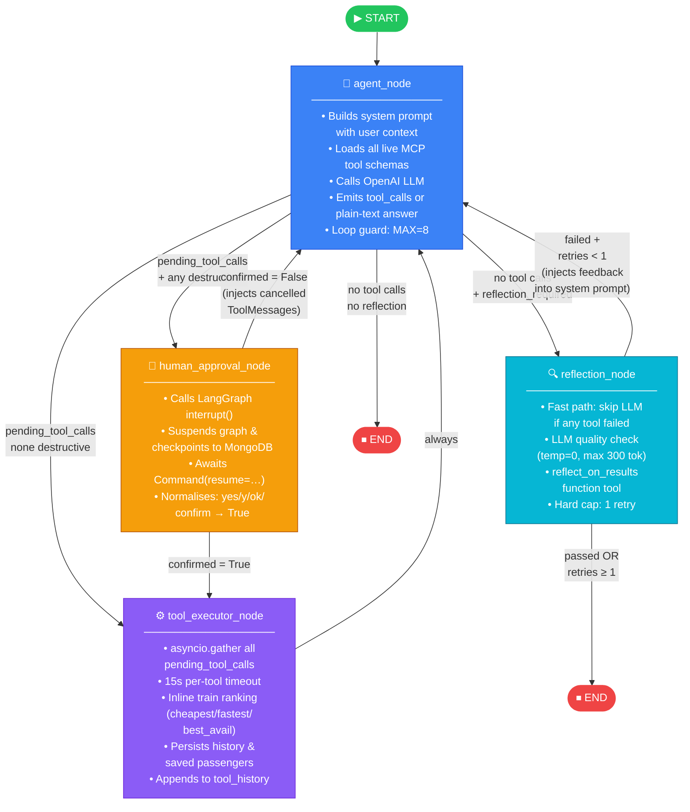

### Routing Rules

| From                  | Condition                                | To                    |
| --------------------- | ---------------------------------------- | --------------------- |
| `agent_node`          | pending tool calls + any destructive     | `human_approval_node` |
| `agent_node`          | pending tool calls, none destructive     | `tool_executor_node`  |
| `agent_node`          | no pending calls + `reflection_required` | `reflection_node`     |
| `agent_node`          | no pending calls                         | `END`                 |
| `human_approval_node` | `confirmed = True`                       | `tool_executor_node`  |
| `human_approval_node` | `confirmed = False`                      | `agent_node`          |
| `tool_executor_node`  | always                                   | `agent_node`          |
| `reflection_node`     | `reflection_passed = True`               | `END`                 |
| `reflection_node`     | failed + `retries >= 1`                  | `END`                 |
| `reflection_node`     | failed + `retries < 1`                   | `agent_node`          |

---

## Agent State (`TravelState`)

`app/graph/state.py` — the full TypedDict that flows through every node.

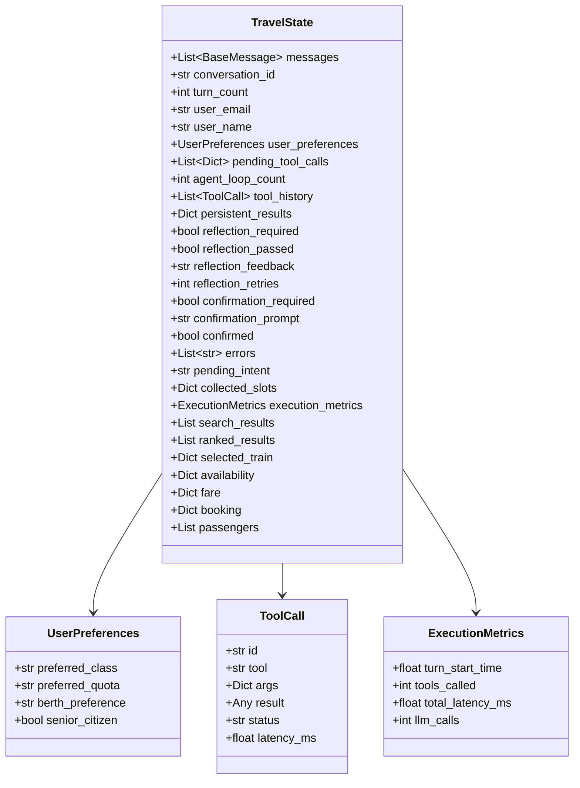

---

## MCP Tool Catalogue

The `mcp_server_irctc` exposes **19 tools** over the MCP Streamable HTTP protocol. The `ai-service` discovers them at startup and feeds their OpenAI-formatted schemas directly to the LLM every turn.

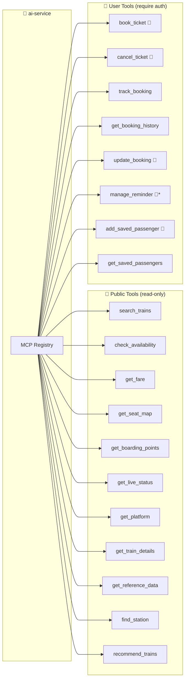

> 🔴 = **destructive** — requires human approval via `human_approval_node` before execution.  
> \* `manage_reminder` is only destructive when `action = "delete"`.

### Typical Booking Flow

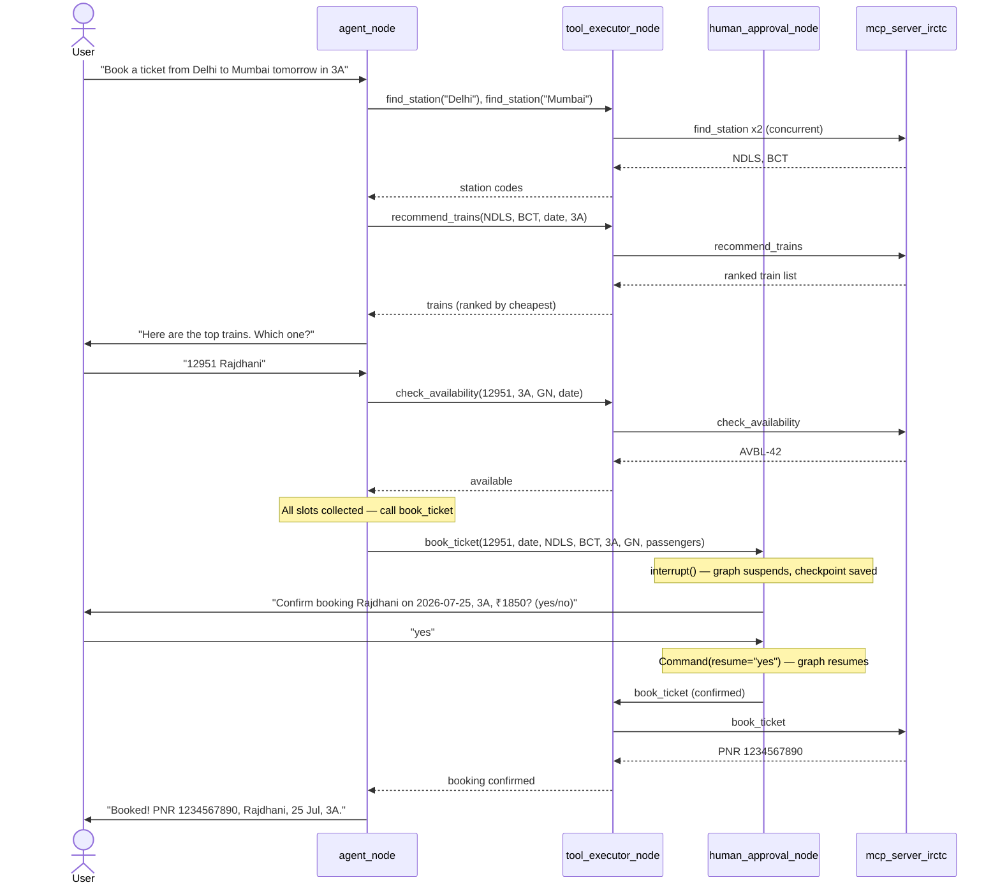

---

## Memory Architecture

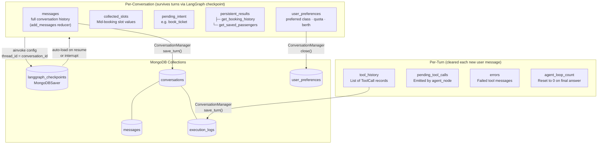

### Sliding Window

`conversation_memory.py` applies a **20-message sliding window** before every LLM call.  
The first `HumanMessage` is always anchored; `ToolMessage` entries are excluded from the window (they surface via the context block in the system prompt instead).

### Rolling Summary

`ConversationManager.summarize()` runs an LLM call (max 200 words) every 10 turns and stores it in the `conversations` collection. It is prepended to the context for long-running conversations.

---

## MCP Layer Internals

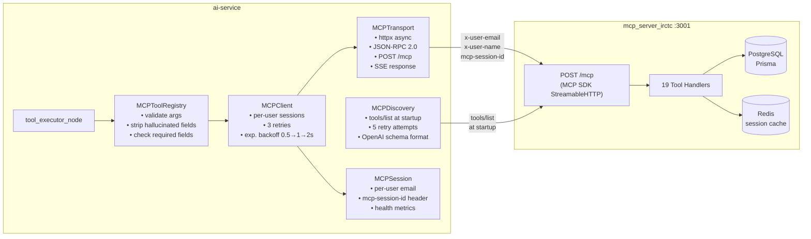

---

## Train Ranking (`app/graph/ranking.py`)

Applied inline in `tool_executor_node` after every `search_trains` or `recommend_trains` response. Pure Python — no LLM involved.

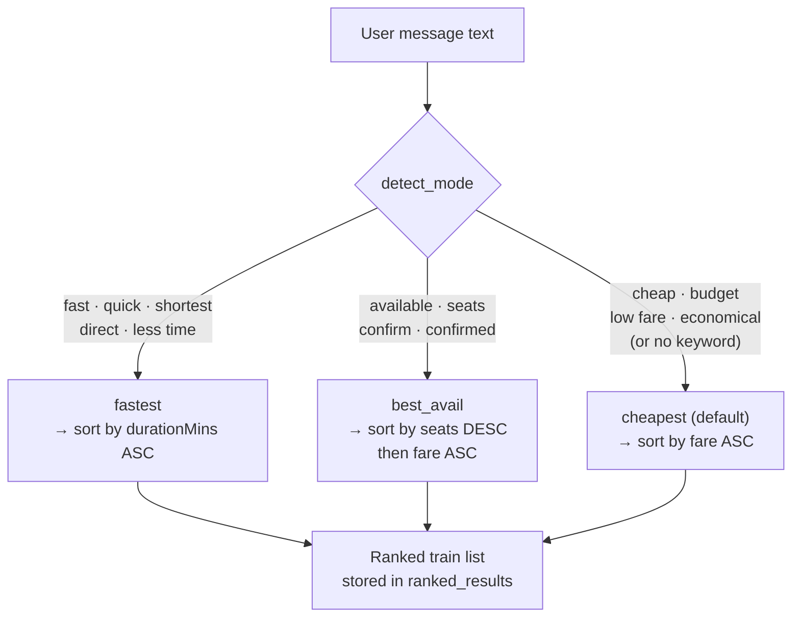

Fields parsed from MCP responses: `durationMins` / `duration` (string `"2h30m"` or `"2:30"`), `fare.amount` / `fare.total` / `fare.breakdown.total`, `availability.count` / `availability.available`.

---

## Destructive Tool Gate

Six tools require explicit human confirmation. The decision is codified in `app/graph/tool_meta.py` — the **only file** in the codebase where tool names are hardcoded.

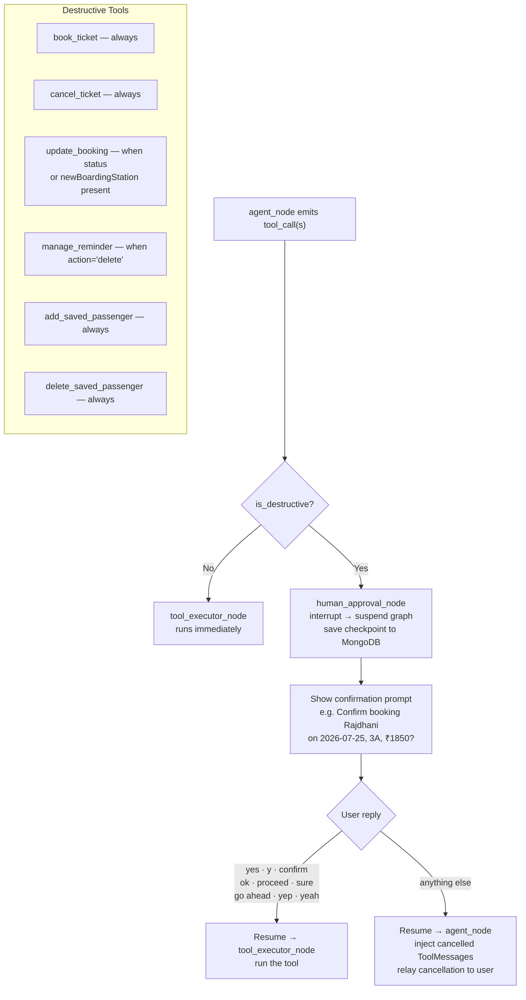

---

## Auth Flow

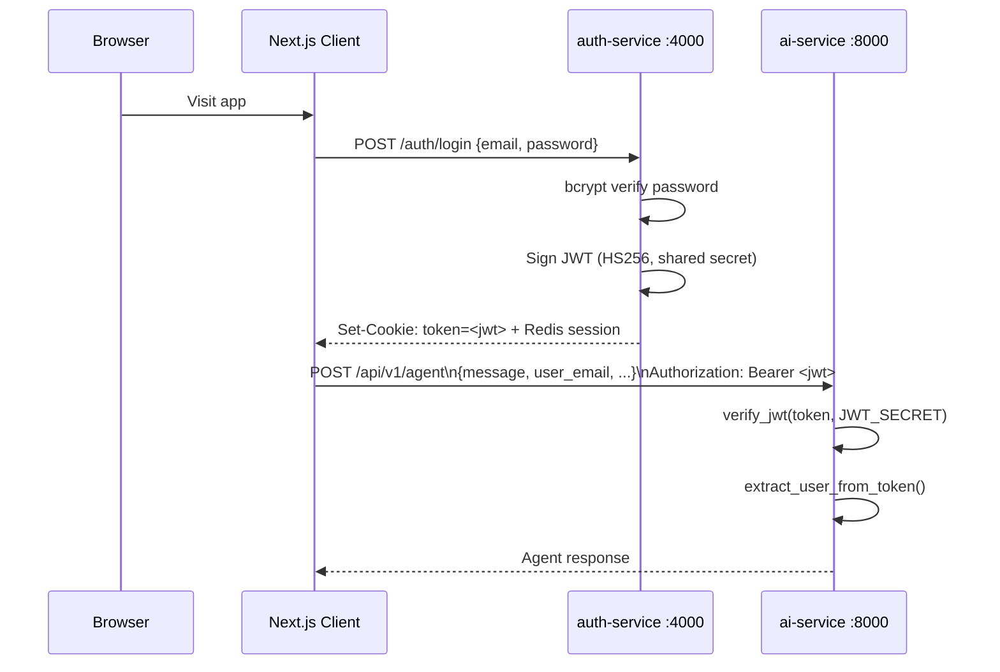

> The `JWT_SECRET` is shared between `auth-service` and `ai-service`. Both services must have identical values configured.

---

## Real-Time Streaming (Socket.IO)

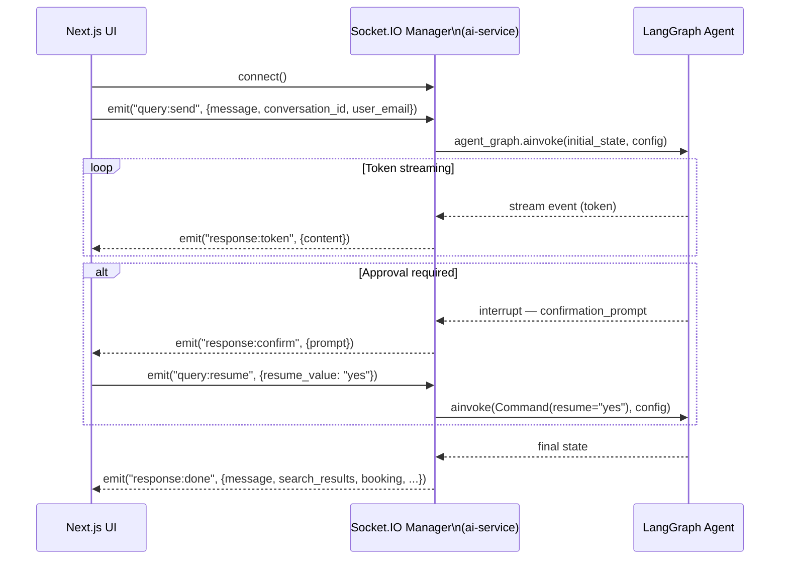

---

## Startup Sequence

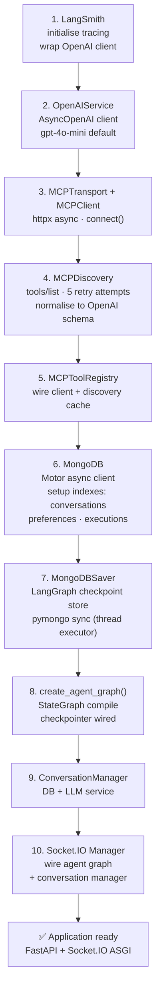

---

## Database Models

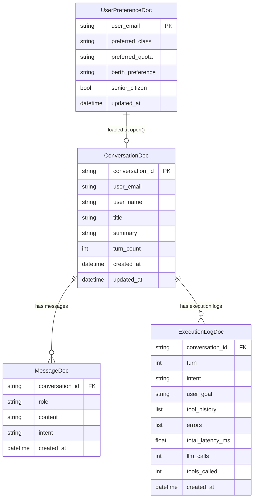

> MongoDB collections: `conversations`, `messages`, `user_preferences`, `execution_logs`, `langgraph_checkpoints` (LangGraph-managed).

---

## API Reference

Base path: `/api/v1`

### Health

| Method | Path      | Description                                      |
| ------ | --------- | ------------------------------------------------ |
| `GET`  | `/health` | Liveness probe — returns `{status, environment}` |

### Chat

| Method | Path           | Description                                                              |
| ------ | -------------- | ------------------------------------------------------------------------ |
| `POST` | `/chat`        | Non-streaming LLM completion via `ChatService`                           |
| `POST` | `/chat/stream` | Token-by-token SSE stream, emits `{"content": token}` + `{"done": true}` |
| `POST` | `/agent`       | Run the full LangGraph agent (see below)                                 |

**`POST /agent` — Request**

```json
{
    "message": "Find trains from Delhi to Mumbai tomorrow",
    "conversation_id": "conv_abc123",
    "user_email": "user@example.com",
    "user_name": "Alice",
    "resume": false,
    "resume_value": null,
    "search_results": null,
    "selected_train": null,
    "availability": null,
    "fare": null,
    "passengers": null,
    "booking": null
}
```

Send `"resume": true` with `"resume_value": "yes"` (or `"no"`) to resume a graph suspended at a human approval gate.

**`POST /agent` — Response**

```json
{
  "message":             "Here are trains on that route…",
  "intent":              "search_trains",
  "travel_context":      { "from_station": "NDLS", "to_station": "BCT", "date": "2026-07-25" },
  "search_results":      [...],
  "selected_train":      null,
  "availability":        null,
  "fare":                null,
  "booking":             null,
  "confirmation_required": false,
  "confirmation_prompt": null,
  "interrupted":         false,
  "errors":              []
}
```

When `"interrupted": true`, the graph is paused at a human approval gate. Re-send with `"resume": true`.

### Conversations

| Method | Path                            | Description                               |
| ------ | ------------------------------- | ----------------------------------------- |
| `GET`  | `/conversations/{id}/messages`  | Message history (default limit: 50)       |
| `GET`  | `/conversations/{id}/context`   | Summary + recent messages for resume      |
| `GET`  | `/conversations/user/{email}`   | List conversations for a user (limit: 20) |
| `POST` | `/conversations/{id}/summarize` | Trigger rolling LLM summary               |

### Socket.IO Events

| Direction       | Event              | Payload                                             |
| --------------- | ------------------ | --------------------------------------------------- |
| Client → Server | `query:send`       | `{message, conversation_id, user_email, user_name}` |
| Client → Server | `query:resume`     | `{conversation_id, resume_value}`                   |
| Server → Client | `response:token`   | `{content: "<token>"}`                              |
| Server → Client | `response:confirm` | `{prompt: "<confirmation question>"}`               |
| Server → Client | `response:done`    | Full structured agent response                      |
| Server → Client | `response:error`   | `{error: "<message>"}`                              |

---

## Error Handling

| Exception                     | HTTP Status | Trigger                           |
| ----------------------------- | ----------- | --------------------------------- |
| `ValidationException`         | 400         | Malformed request                 |
| `AuthenticationException`     | 401         | Invalid OpenAI API key            |
| `RateLimitException`          | 429         | OpenAI rate limit                 |
| `ModelProviderException`      | 502         | Generic OpenAI API error          |
| `ServiceUnavailableException` | 503         | Connection timeout, quota/billing |

Raw SDK messages and stack traces are never forwarded to clients.

---

## Project Structure

```
irctc_agent2/
├── client/                         # Next.js 16 chat UI
│   ├── app/                        # App Router pages
│   ├── components/                 # React components
│   ├── store/                      # Redux Toolkit slices
│   ├── hooks/                      # Custom React hooks
│   └── lib/                        # API clients, socket setup
│
├── ai-service/                     # FastAPI + LangGraph orchestration
│   └── app/
│       ├── api/                    # HTTP routes (chat, agent, conversations)
│       ├── auth/                   # JWT verification, CurrentUser
│       ├── config/                 # Pydantic settings, constants
│       ├── core/                   # Exceptions, handlers, lifespan
│       ├── db/                     # MongoDB models + repositories
│       ├── graph/
│       │   ├── builder.py          # StateGraph compilation
│       │   ├── edges.py            # Conditional routing functions
│       │   ├── ranking.py          # Deterministic train ranking
│       │   ├── state.py            # TravelState TypedDict
│       │   ├── tool_meta.py        # DESTRUCTIVE_TOOLS registry
│       │   └── nodes/
│       │       ├── agent_node.py            # LLM decision node
│       │       ├── tool_executor_node.py    # Concurrent MCP execution
│       │       ├── human_approval_node.py   # Interrupt/approval gate
│       │       └── reflection_node.py       # Quality-check pass
│       ├── mcp/                    # Transport, client, discovery, registry
│       ├── memory/                 # Checkpoints, context builder, preferences
│       ├── services/               # ChatService, ConversationManager, OpenAIService
│       ├── telemetry/              # Loguru logging
│       ├── websocket/              # Socket.IO event handlers
│       └── main.py                 # ASGI entry point
│
├── services/
│   ├── auth-service/               # Express 5 + Prisma + PostgreSQL + Redis
│   │   ├── src/
│   │   │   ├── controllers/
│   │   │   ├── services/
│   │   │   ├── repositories/
│   │   │   ├── middleware/
│   │   │   ├── routes/
│   │   │   └── utils/
│   │   └── prisma/
│   │
│   └── mcp_server_irctc/           # MCP SDK + 19 IRCTC tools
│       ├── src/
│       │   ├── tools/              # 19 MCP tool handlers
│       │   ├── services/
│       │   ├── repositories/
│       │   ├── types/
│       │   └── utils/
│       └── prisma/
```

---

## Tech Stack

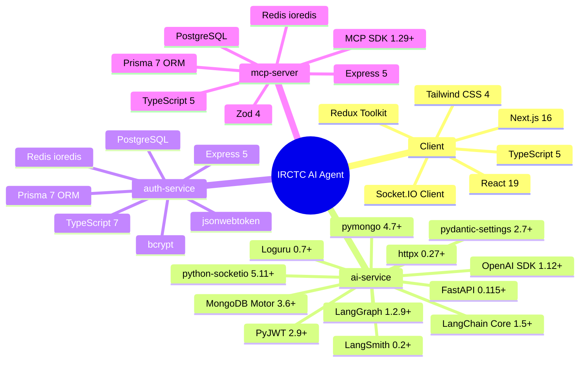

---

## Local Development

### Prerequisites

- Python 3.11+
- Node.js 20+
- MongoDB (local or `MONGO_URL` env)
- PostgreSQL (for auth-service and mcp_server_irctc)
- Redis (for auth-service and mcp_server_irctc)

### 1 — MCP Server

```bash
cd services/mcp_server_irctc
cp .env.example .env        # fill DATABASE_URL, REDIS_URL
npm install
npm run db:setup            # generate + migrate + seed
npm run dev                 # :3001
```

### 2 — Auth Service

```bash
cd services/auth-service
cp .env.example .env        # fill DATABASE_URL, REDIS_URL, JWT_SECRET
npm install
npm run db:setup
npm run dev                 # :4000
```

### 3 — AI Service

```bash
cd ai-service
python -m venv .venv && source .venv/bin/activate
pip install -e .
cp .env.example .env
# Required: OPENAI_API_KEY (sk-...), JWT_SECRET (match auth-service)
# Optional: MCP_SERVER_URL, MONGO_URL, LANGSMITH_API_KEY
uvicorn app.main:app --host 0.0.0.0 --port 8000 --reload
```

Interactive API docs: `http://localhost:8000/docs` (disabled in `production` env).

### 4 — Client

```bash
cd client
cp .env.example .env        # fill NEXT_PUBLIC_AI_SERVICE_URL
npm install
npm run dev                 # :3000
```

---

## Configuration

### ai-service (`ai-service/.env`)

| Variable               | Default                     | Required | Description                   |
| ---------------------- | --------------------------- | -------- | ----------------------------- |
| `OPENAI_API_KEY`       | —                           | **Yes**  | Must start with `sk-`         |
| `OPENAI_DEFAULT_MODEL` | `gpt-4o-mini`               | No       | OpenAI model                  |
| `JWT_SECRET`           | `change-me`                 | **Yes**  | Shared with auth-service      |
| `JWT_ALGORITHM`        | `HS256`                     | No       | JWT algorithm                 |
| `MCP_SERVER_URL`       | `http://localhost:3001`     | No       | MCP server base URL           |
| `MCP_SERVER_TIMEOUT`   | `30.0`                      | No       | Per-request timeout (seconds) |
| `MONGO_URL`            | `mongodb://localhost:27017` | No       | MongoDB connection string     |
| `MONGO_DB`             | `irctc_ai`                  | No       | Database name                 |
| `APP_ENV`              | `development`               | No       | `development` / `production`  |
| `DEBUG`                | `false`                     | No       | Enables hot reload + API docs |
| `LOG_LEVEL`            | `INFO`                      | No       | Loguru level                  |
| `LANGSMITH_TRACING`    | `false`                     | No       | Enable LangSmith tracing      |
| `LANGSMITH_API_KEY`    | —                           | No       | Required if tracing enabled   |
| `LANGSMITH_PROJECT`    | `default`                   | No       | LangSmith project name        |

### Docker

Each service ships a `Dockerfile`. The MCP server also has a `docker-compose.yml` for running with PostgreSQL and Redis together.

```bash
# ai-service
docker build -t ai-service ./ai-service
docker run --env-file ai-service/.env -p 8000:8000 ai-service
```

---

## Key Design Decisions

**Single decision node** — `agent_node` replaces what used to be separate intent, slot-filler, planner, and response nodes. The LLM reads live MCP tool schemas every turn and decides entirely on its own what to call. This means adding a new read-only MCP tool requires zero changes to the Python code.

**Intent gate in the system prompt** — the prompt includes an explicit `INTENT GATE` section with labelled examples of what phrases should and should not trigger mutating tools. This prevents the model from pre-emptively booking or saving passengers when the user is just browsing.

**Slot-filling in state** — `pending_intent` and `collected_slots` survive in the LangGraph checkpoint across turns. When the user answers a follow-up question ("Kevin, 22, MALE"), `agent_node` re-reads those fields and continues from where it left off rather than starting over.

**Human approval via LangGraph interrupt** — destructive calls do not go through a custom gate node that polls a flag. They use `interrupt()`, which suspends the graph execution, serialises the full state to MongoDB, and returns control to the HTTP handler. The graph resumes on the next HTTP request with `Command(resume=value)`. This means the approval is durable across process restarts.

**Deterministic ranking** — train ranking happens in pure Python inside `tool_executor_node`, never by asking the LLM to sort. This keeps results consistent and avoids burning tokens on ordering.

**Persistent results** — `get_booking_history` and `get_saved_passengers` are cached in `persistent_results` and injected into the system prompt context block. The LLM is explicitly told not to call these tools again unless the user asks to refresh. This cuts round-trips on common follow-up questions.

**Reflection hard cap** — the reflection node is gated on `reflection_retries < 1`. At most one LLM quality-check call and one retry happen per turn. Reflection failures are always open — if the checker itself throws, `reflection_passed = True` so the original answer is returned.

---

## MCP Reference Values

| Class | Name                | Quota | Name            |
| ----- | ------------------- | ----- | --------------- |
| `SL`  | Sleeper             | `GN`  | General         |
| `3A`  | AC 3 Tier           | `LD`  | Ladies          |
| `2A`  | AC 2 Tier           | `TQ`  | Tatkal          |
| `1A`  | AC First Class      | `PT`  | Premium Tatkal  |
| `CC`  | AC Chair Car        | `HO`  | Higher Official |
| `EC`  | Executive Chair Car | `SS`  | Senior Citizen  |
| `2S`  | Second Sitting      |       |                 |
| `VS`  | Vistadome AC        |       |                 |

**Berth preferences:** `LB` Lower · `MB` Middle · `UB` Upper · `SL` Side Lower · `SUB` Side Upper · `WS` Window Seat

**Booking statuses:** `PENDING` · `BOOKED` · `RAC` · `WL` · `CANCELLED` · `FAILED`

**Reminder types:** `JOURNEY` · `PNR` · `BOOKING`

---
